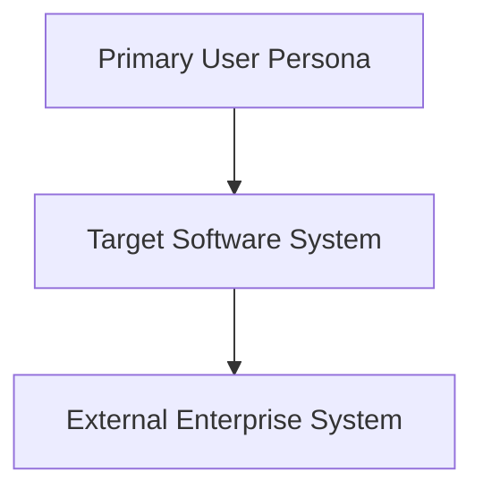
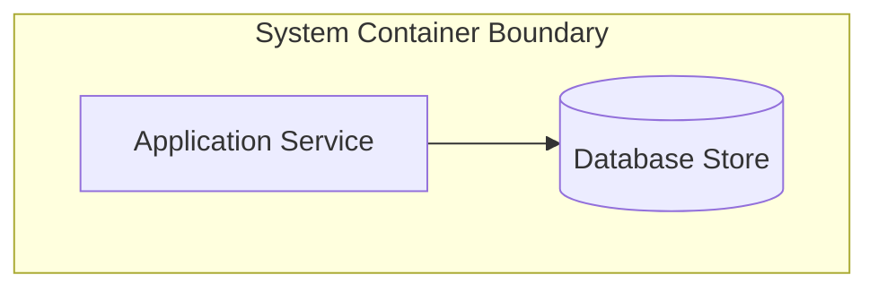
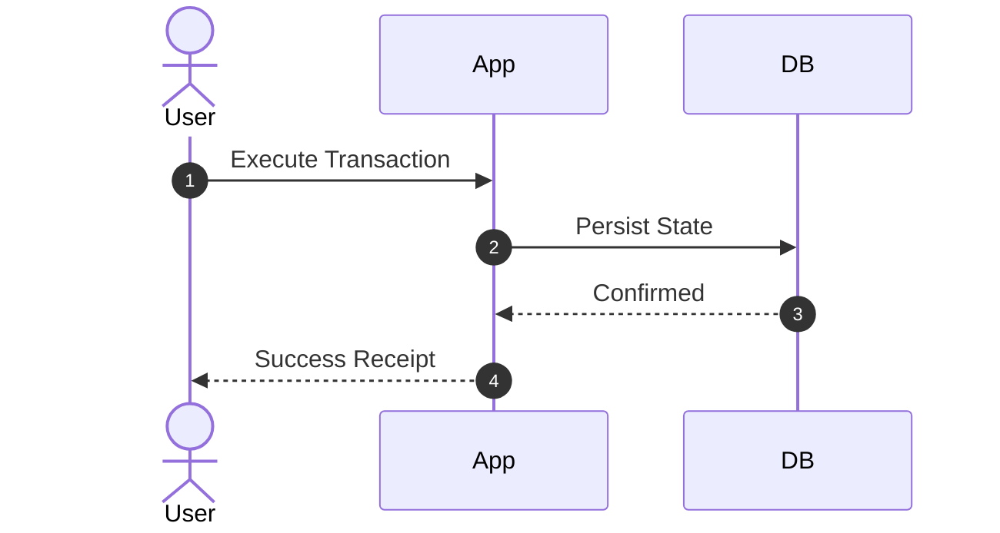

# Industry Vertical Architecture Example Starter Template

Use this template when authoring new end-to-end industry reference designs.

## 1. Business Context & Architectural Drivers
* **Domain Focus**: Description of the business vertical and market drivers.
* **Quantitative NFRs**: Throughput (TPS), Latency budgets (p99), and Availability targets (99.9x%).
* **Regulatory Constraints**: Applicable compliance frameworks (e.g., GDPR, PCI-DSS, HIPAA, FedRAMP).

## 2. C4 Level 1: System Context

## 3. C4 Level 2: Container Architecture

## 4. Core Business Sequence Flow

## 5. Key Architectural Decisions (ADRs)
* **ADR-01**: Document architectural choices, trade-offs, and rejected options.
