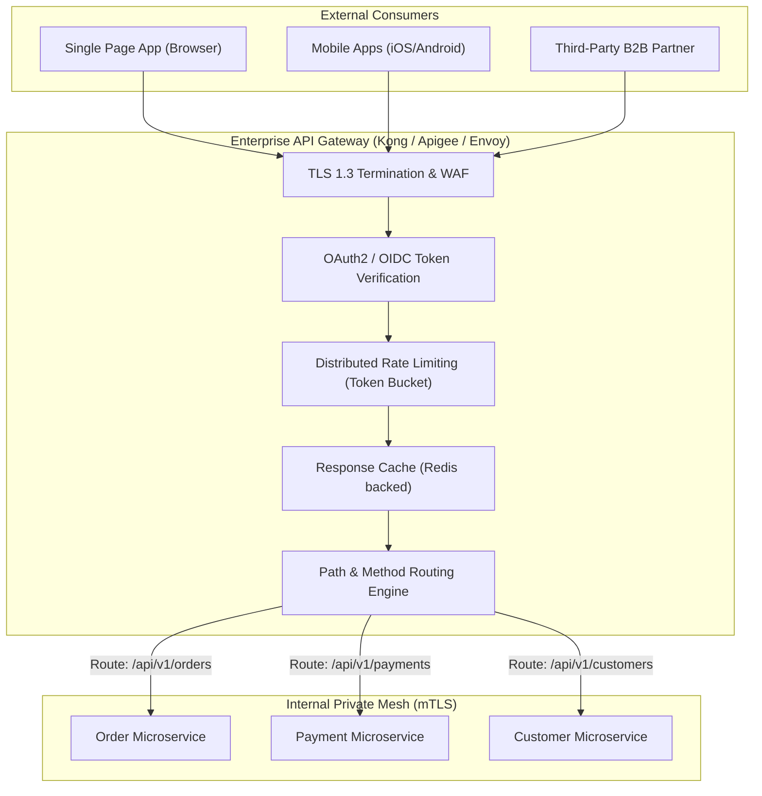
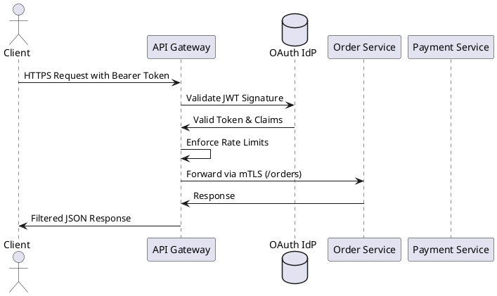

# Modern API Gateway Integration Architecture

Lightweight, cloud-native API Gateway pattern providing perimeter security, SSL termination, traffic management, and rate limiting.

## Mermaid Architecture Diagram

## PlantUML Specification

## Architectural Design Considerations

* **Dumb Pipes Principle**: Unlike an ESB, an API Gateway focuses strictly on edge routing, authentication, and traffic policy without performing heavy business transformations.
* **BFF (Backend for Frontend)**: Implement distinct API gateways tailored to specific client form factors (Mobile BFF vs Web BFF vs Partner Gateway).
* **High Availability**: Deploy gateways across multiple availability zones backed by auto-scaling groups to sustain high-volume traffic bursts.

## Related Documentation & Patterns

* [Security: API Security](file:///d:/company/products/enterprise-architecture-handbook/17-diagrams/security/api-security.md)
* [ESB](file:///d:/company/products/enterprise-architecture-handbook/17-diagrams/integration/esb.md)
* [Event Mesh](file:///d:/company/products/enterprise-architecture-handbook/17-diagrams/integration/event-mesh.md)
