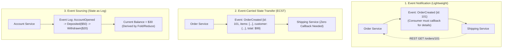
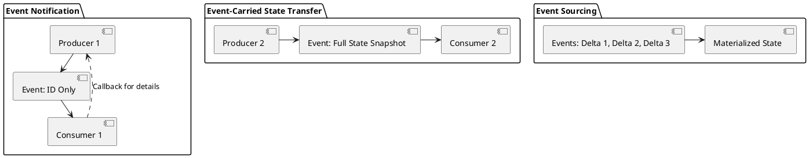

# Event-Driven Architecture (EDA) Messaging Paradigms

Comprehensive event-driven integration paradigms comparing Simple Event Notification, Event-Carried State Transfer (ECST), and Event Sourcing.

## Mermaid Architecture Diagram

## PlantUML Specification

## Architectural Design Considerations

* **Event-Carried State Transfer**: Maximizes consumer autonomy and decouples availability, eliminating downstream query storms on producers.
* **Payload Size Constraints**: Avoid bloating events beyond broker message limits (e.g., Kafka default 1MB); use Claim-Check pattern for large media assets.
* **Schema Evolution Discipline**: Changes to event structures must be non-breaking (e.g., additive fields only).

## Related Documentation & Patterns

* [Event Mesh](file:///d:/company/products/enterprise-architecture-handbook/17-diagrams/integration/event-mesh.md)
* [RPC vs Events](file:///d:/company/products/enterprise-architecture-handbook/17-diagrams/integration/rpc-vs-events.md)
* [CQRS & Event Sourcing](file:///d:/company/products/enterprise-architecture-handbook/17-diagrams/application/cqrs-es.md)
