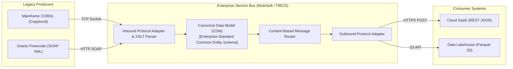
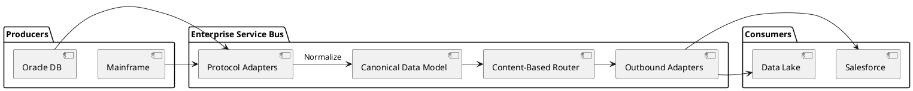

# Enterprise Service Bus (ESB) & Canonical Data Model

Heavyweight enterprise service bus (ESB) integration detailing message mediation, XML/XSLT transformations, and the Canonical Data Model (CDM).

## Mermaid Architecture Diagram

## PlantUML Specification

## Architectural Design Considerations

* **Smart Pipes, Dumb Endpoints**: The ESB represents the classic 'smart pipes' philosophy, placing heavy business transformation logic directly inside the integration infrastructure.
* **Architectural Anti-Pattern at Scale**: Can degrade into an unmaintainable monolithic bus where business logic becomes obscured and impossible to test locally.
* **Modern Evolution**: Modern systems replace monolithic ESBs with 'dumb pipes, smart endpoints' (Kafka event streams + microservice consumers).

## Related Documentation & Patterns

* [Hub-and-Spoke](file:///d:/company/products/enterprise-architecture-handbook/17-diagrams/integration/hub-and-spoke.md)
* [Modern API Gateway](file:///d:/company/products/enterprise-architecture-handbook/17-diagrams/integration/api-gateway.md)
* [Event-Driven Architecture](file:///d:/company/products/enterprise-architecture-handbook/17-diagrams/integration/eda.md)
