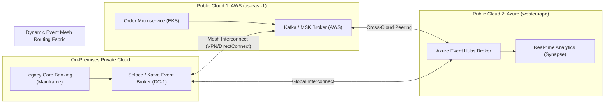
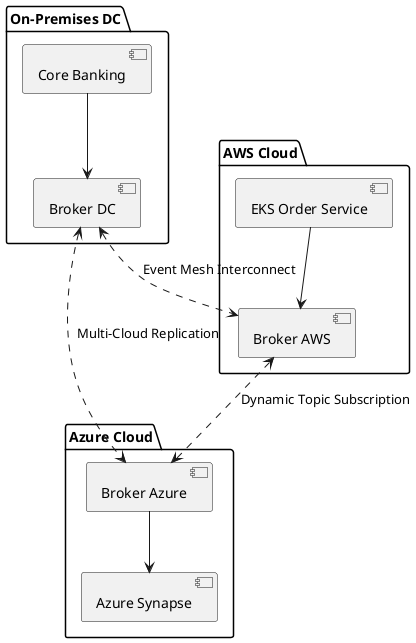

# Enterprise Event Mesh Architecture (Multi-Cloud Fabric)

Dynamic multi-cloud event distribution fabric connecting event brokers across private data centers, AWS, and Azure with intelligent message routing.

## Mermaid Architecture Diagram

## PlantUML Specification

## Architectural Design Considerations

* **Location Transparency**: Producers publish events locally; the mesh automatically routes events dynamically to interested subscribers anywhere in the world.
* **WAN Optimization**: Event meshes compress traffic and coalesce connections across high-cost cross-cloud WAN links.
* **Hybrid Cloud Enabler**: Facilitates gradual legacy data center modernization without requiring risky big-bang system cutovers.

## Related Documentation & Patterns

* [Modern API Gateway](file:///d:/company/products/enterprise-architecture-handbook/17-diagrams/integration/api-gateway.md)
* [Event-Driven Architecture](file:///d:/company/products/enterprise-architecture-handbook/17-diagrams/integration/eda.md)
* [RPC vs Events](file:///d:/company/products/enterprise-architecture-handbook/17-diagrams/integration/rpc-vs-events.md)
