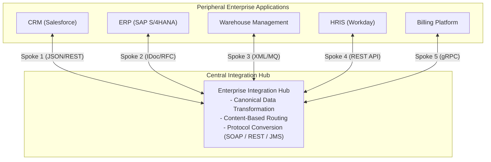
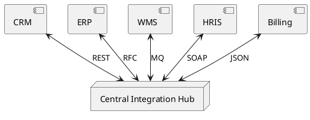

# Hub-and-Spoke Integration Model

Centralized hub-and-spoke integration architecture reducing connection complexity from $O(N^2)$ to $O(N)$ via central translation brokers.

## Mermaid Architecture Diagram

## PlantUML Specification

## Architectural Design Considerations

* **Complexity Reduction**: Reduces $N(N-1)/2$ connections down to $N$ direct connections to the central hub.
* **Single Point of Failure (SPOF)**: The central hub represents a single point of failure and scalability bottleneck if not clustered across multi-region infrastructure.
* **Governance Balance**: Centralized teams managing the hub often become delivery bottlenecks unless self-service integration capabilities are provided.

## Related Documentation & Patterns

* [Point-to-Point](file:///d:/company/products/enterprise-architecture-handbook/17-diagrams/integration/point-to-point.md)
* [Enterprise Service Bus](file:///d:/company/products/enterprise-architecture-handbook/17-diagrams/integration/esb.md)
* [Event Mesh](file:///d:/company/products/enterprise-architecture-handbook/17-diagrams/integration/event-mesh.md)
