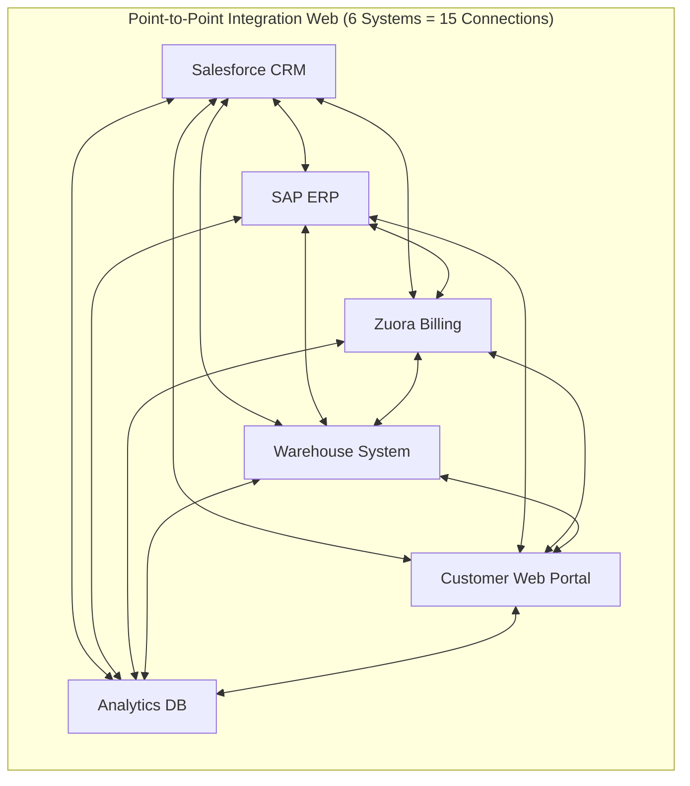
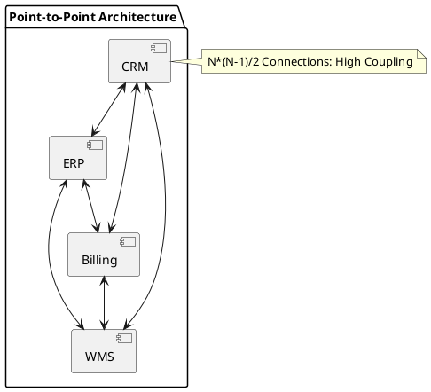

# Point-to-Point Integration Anti-Pattern (N*(N-1)/2 Spaghetti)

Point-to-point architectural topology illustrating the quadratic connection explosion and coupling nightmare of direct system-to-system integrations.

## Mermaid Architecture Diagram

## PlantUML Specification

## Architectural Design Considerations

* **Quadratic Complexity**: For $N$ systems, point-to-point requires $N(N-1)/2$ integrations, causing catastrophic maintenance overhead.
* **Coupling & Fragility**: A change to a single internal schema or API breaks multiple direct consumers simultaneously.
* **Migration Strategy**: Break point-to-point coupling by introducing an intermediate API Gateway, Canonical Data Model, or Event Broker.

## Related Documentation & Patterns

* [Hub-and-Spoke](file:///d:/company/products/enterprise-architecture-handbook/17-diagrams/integration/hub-and-spoke.md)
* [Modern API Gateway](file:///d:/company/products/enterprise-architecture-handbook/17-diagrams/integration/api-gateway.md)
* [Event Mesh](file:///d:/company/products/enterprise-architecture-handbook/17-diagrams/integration/event-mesh.md)
