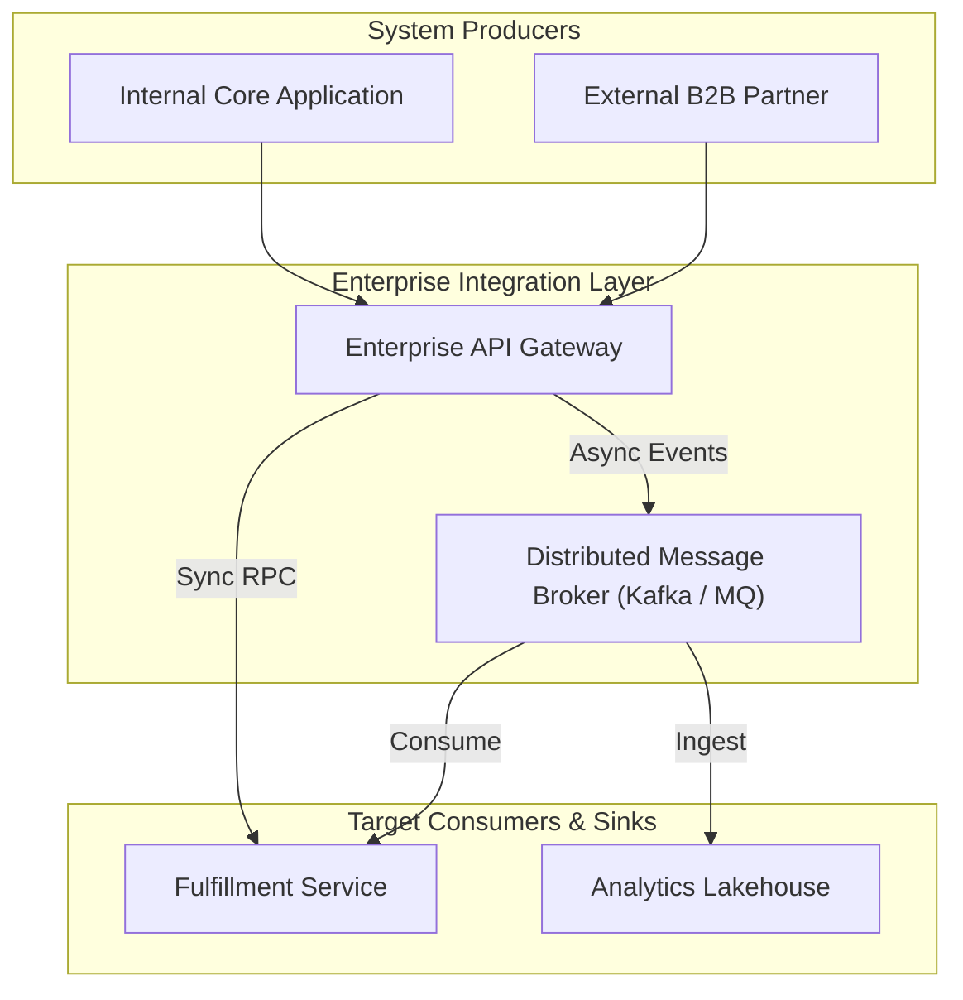
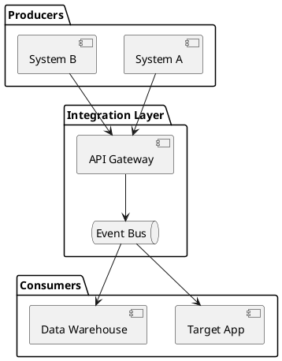

# Integration Architecture Starter Template

Standardized template for modeling multi-system integration topologies across API gateways, message buses, and external partners.

## Mermaid Architecture Diagram

## PlantUML Specification

## Architectural Design Considerations

* **Standard Starter**: Copy and adapt this template when mapping integration touchpoints between disparate systems.
* **Protocol Annotations**: Clearly label protocols (REST, gRPC, SFTP, Kafka) directly on connections.
* **Separation of Concerns**: Differentiate real-time synchronous APIs from asynchronous event queues.

## Related Documentation & Patterns

* [Modern API Gateway](file:///d:/company/products/enterprise-architecture-handbook/17-diagrams/integration/api-gateway.md)
* [Event-Driven Architecture](file:///d:/company/products/enterprise-architecture-handbook/17-diagrams/integration/eda.md)
* [Integration Review Checklist](file:///d:/company/products/enterprise-architecture-handbook/17-diagrams/integration/checklists.md)
