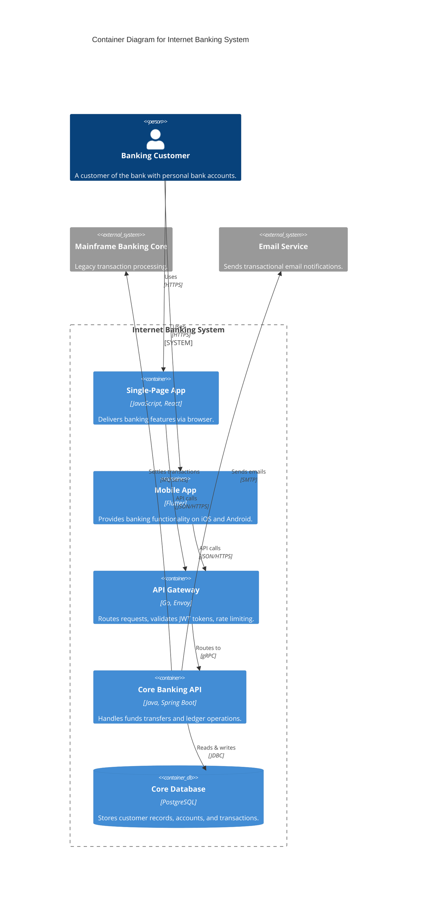

# C4-Mermaid Native Architecture Modeling

Mermaid natively supports C4 model diagrams using the `C4Context`, `C4Container`, and `C4Component` keywords.

## C4 Container Diagram in Pure Mermaid

## Architectural Guidelines
* C4-Mermaid provides standardized C4 colors and shapes automatically without requiring manual `classDef` styling.
