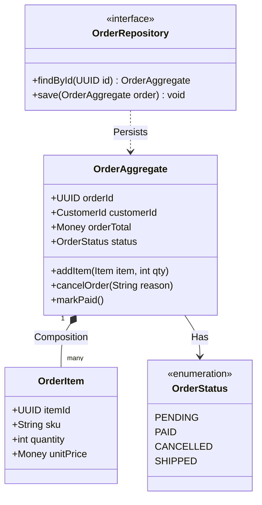

# Mermaid Class Diagrams & Object Models

Class diagrams represent domain aggregate structures, design patterns, and entity relationships in Object-Oriented and Domain-Driven Design (DDD).

## Domain-Driven Design (DDD) Aggregate Model

## Visibility Modifiers
* `+` : Public
* `-` : Private
* `#` : Protected
* `~` : Package / Internal
