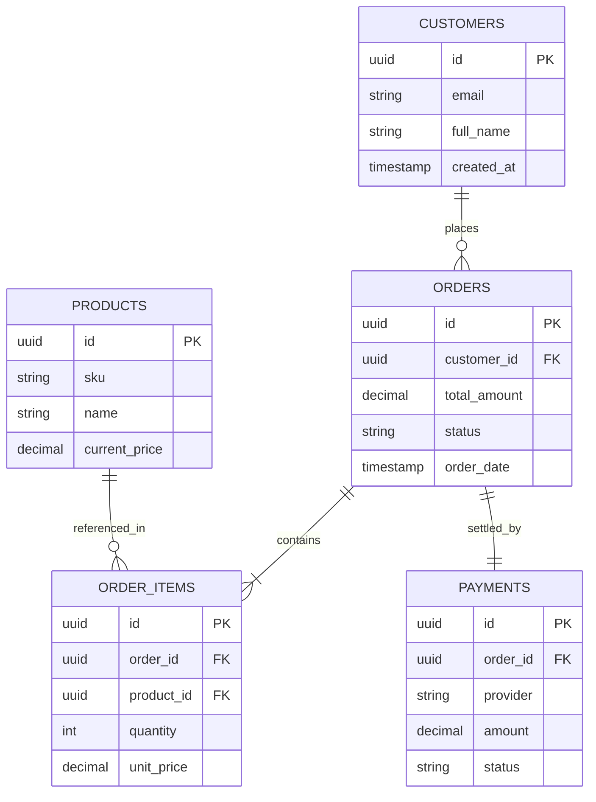

# Mermaid Entity-Relationship (ER) Diagrams

ER diagrams model relational schemas, primary/foreign key mappings, and table cardinalities using Crow's Foot notation.

## E-Commerce Core Relational Schema

## Crow's Foot Cardinality Syntax
* `||--||` : Exactly one to exactly one
* `||--o{` : One to zero or many
* `||--|{` : One to one or many
* `}o--o{` : Zero or many to zero or many
