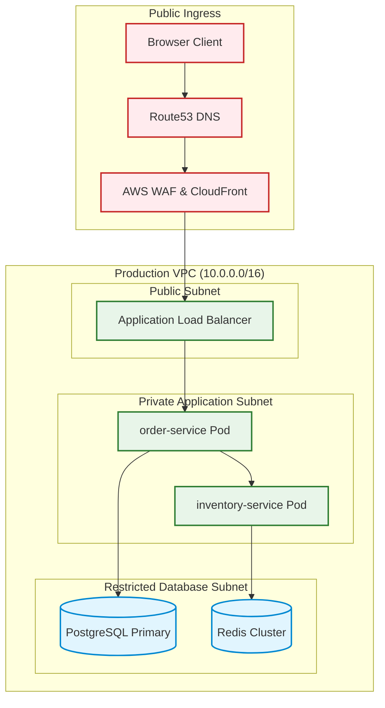

# Mermaid Flowcharts & Subgraph Clustering

Flowcharts are the most versatile diagram type for modeling system top-level architectures, network segments, and procedural workflows.

## Production Microservice Flowchart

## Subgraph Best Practices
1. **Explicit ID**: Always specify both a unique subgraph ID and a display name: `subgraph SubnetA ["Display Name"]`.
2. **Class Assignments**: Apply distinct CSS styles to subgraphs using `classDef` and `class` statements.
