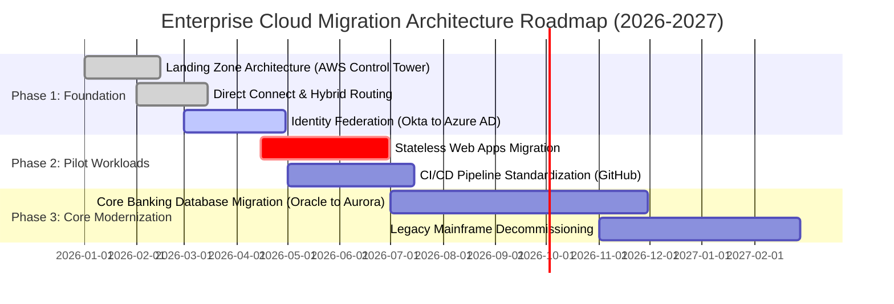

# Mermaid Gantt Roadmaps & Migration Timelines

Gantt charts visually illustrate architecture roadmaps, technical debt retirement timelines, and multi-phase platform migrations.

## Enterprise Cloud Migration Roadmap

## Architectural Guidelines
* Use `done`, `active`, and `crit` flags to indicate completed, ongoing, and critical-path architecture milestones.
