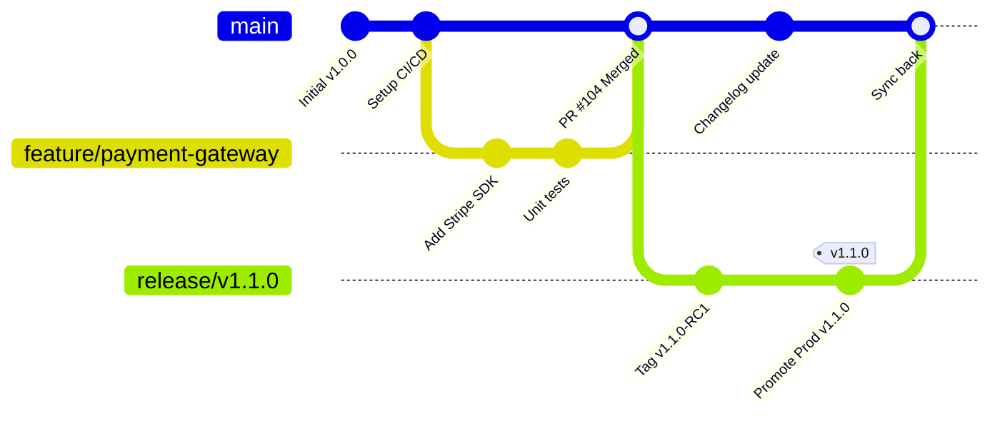

# Mermaid GitGraph & Branching Models

GitGraph visualizes branching strategies, release trains, hotfix flows, and trunk-based development practices.

## Scaled Trunk-Based Development with Short-Lived Feature Branches

## Architectural Guidelines
* Use GitGraph to visually establish development workflows for engineering teams during architecture onboarding.
