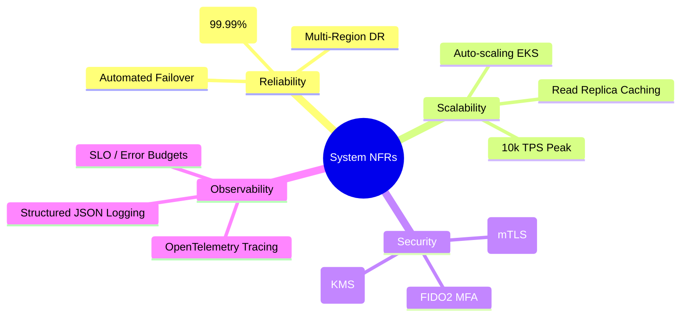

# Mermaid Mindmaps & Architectural Brainstorming

Mindmaps assist architects in brainstorming domain capabilities, organizing non-functional requirements (NFRs), and structuring system decomposition.

## Non-Functional Requirements (NFR) Architecture Taxonomy

## Architectural Guidelines
* Indentation dictates hierarchy; use root nodes to center high-level architecture brainstorming.
