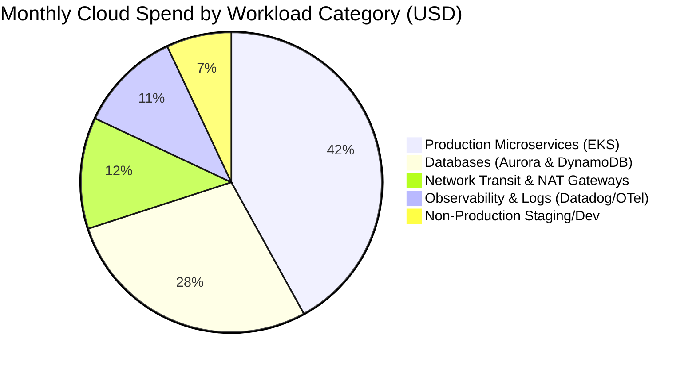

# Mermaid Pie Charts & Portfolio Allocation

Pie charts communicate high-level architecture portfolio splits, cloud infrastructure cost distributions, and technical debt allocation.

## Cloud Infrastructure Monthly Spend Breakdown

## Architectural Guidelines
* Keep categories $\le 6$ slices to maintain visual scannability.
* Highlight dominant cost drivers or technical debt areas directly in Architecture Decision Records (ADRs).
