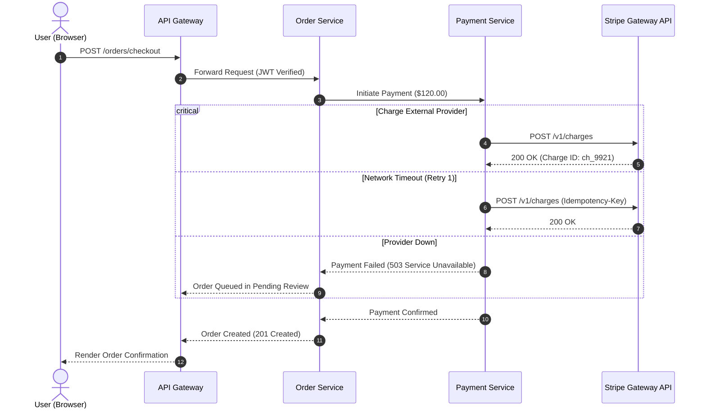

# Mermaid Sequence Diagrams & Advanced Annotations

Sequence diagrams visually communicate dynamic inter-service communication over time.

## Enterprise Payment Sequence with Retry and Fallback

## Architectural Guidelines
* **Autonumbering**: Always use `autonumber` to make diagram steps clear and easy to reference during code and architecture reviews.
* **Control Blocks**: Use `critical`, `alt / else`, `loop`, and `par` blocks to capture non-happy-path real-world behavior.
