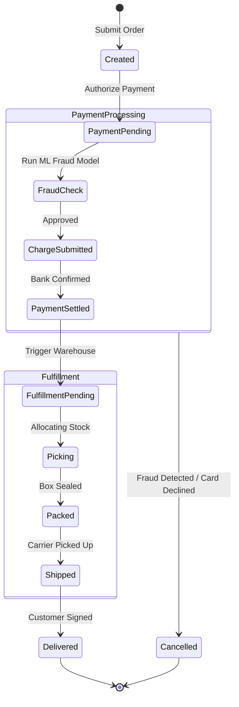

# Mermaid State Diagrams & Lifecycle Transitions

State diagrams capture state machines, distributed transaction sagas, and object lifecycles.

## Order Lifecycle Finite State Machine (FSM)

## Architectural Guidelines
* **Use `stateDiagram-v2`**: Provides modern visual rendering and clean curved connectors.
* **Composite States**: Group related sub-states into parent states (e.g., `PaymentProcessing` or `Fulfillment`) to keep diagrams readable.
