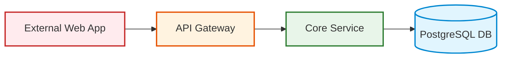

# Mermaid Styling, Themes & Visual Hierarchy Guide

## Color Palette Tokens
Enterprise architecture diagrams should adhere to standardized accessible color tokens:
* Untrusted / External: Fill `#ffebee`, Stroke `#c62828` (Muted Red)
* Perimeter / Ingress: Fill `#fff3e0`, Stroke `#e65100` (Muted Amber)
* Applications / Services: Fill `#e8f5e9`, Stroke `#2e7d32` (Muted Green)
* Persistence / Databases: Fill `#e1f5fe`, Stroke `#0288d1` (Muted Blue)
* Security / KMS / Vault: Fill `#f3e5f5`, Stroke `#7b1fa2` (Muted Purple)

## ClassDef Syntax Example


## Mermaid Theme Directives
Configure global diagram themes using frontmatter directives:
```yaml
%%{init: {'theme': 'neutral', 'themeVariables': { 'primaryColor': '#e8f5e9' }}}%%
```
