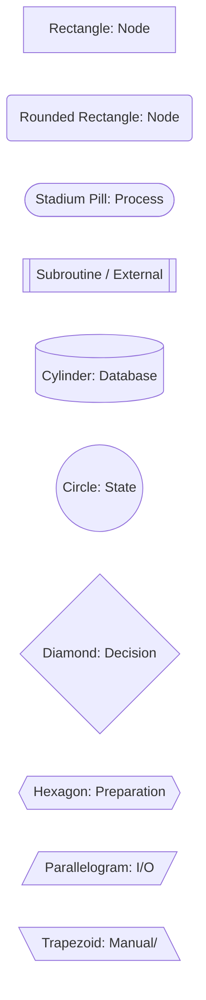
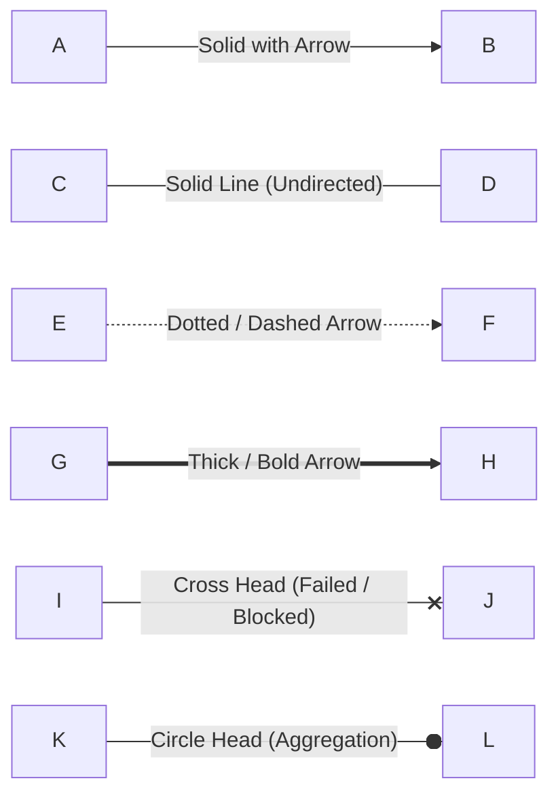

# Mermaid Syntax Guide & Architectural Cheatsheet

## Directionality Directives
Mermaid flowcharts support five fundamental layout directions:
* `graph TB` or `graph TD`: Top-to-Bottom / Top-Down (best for hierarchical layers and trees).
* `graph BT`: Bottom-to-Top (best for dependency graphs pointing upward).
* `graph LR`: Left-to-Right (best for data pipelines, queues, and sequence flows).
* `graph RL`: Right-to-Left.

## Node Shape Syntax

## Line Styles & Link Annotations

## Special Character Escaping
In Mermaid, avoid unquoted parentheses, square brackets, or semicolons inside node names. Always wrap node labels in double quotes:
* Correct: `DB[("PostgreSQL Database (Cluster)")]`
* Incorrect: `DB[(PostgreSQL Database (Cluster))]`
