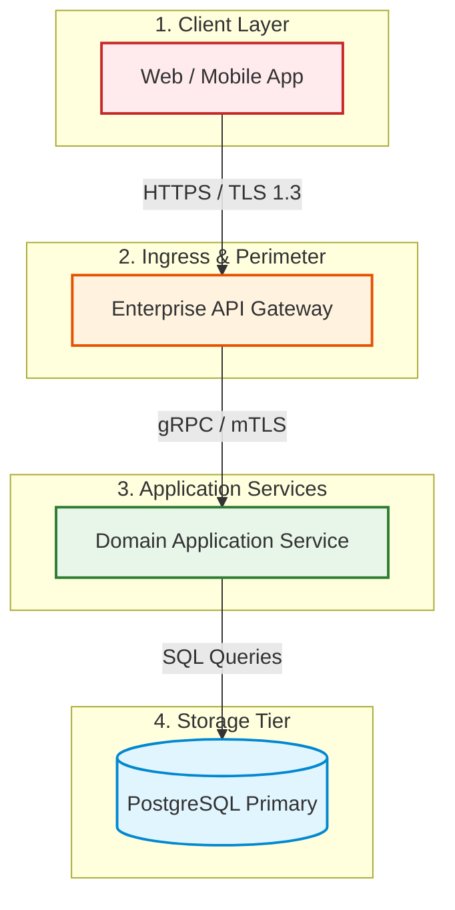

# Mermaid Diagram Starter Template

Use this clean, verified starter template when creating new architecture flowcharts in Markdown.

```mermaid
graph TB
    subgraph ClientZone ["1. Client Layer"]
        Client["Web / Mobile App"]
    end

    subgraph IngressZone ["2. Ingress & Perimeter"]
        Gateway["Enterprise API Gateway"]
        Client -->|"HTTPS / TLS 1.3"| Gateway
    end

    subgraph ServiceZone ["3. Application Services"]
        AppSvc["Domain Application Service"]
        Gateway -->|"gRPC / mTLS"| AppSvc
    end

    subgraph PersistenceZone ["4. Storage Tier"]
        DB[(PostgreSQL Primary)]
        AppSvc -->|"SQL Queries"| DB
    end

    classDef client fill:#ffebee,stroke:#c62828,stroke-width:2px;
    classDef ingress fill:#fff3e0,stroke:#e65100,stroke-width:2px;
    classDef svc fill:#e8f5e9,stroke:#2e7d32,stroke-width:2px;
    classDef db fill:#e1f5fe,stroke:#0288d1,stroke-width:2px;

    class Client client;
    class Gateway ingress;
    class AppSvc svc;
    class DB db;
```
