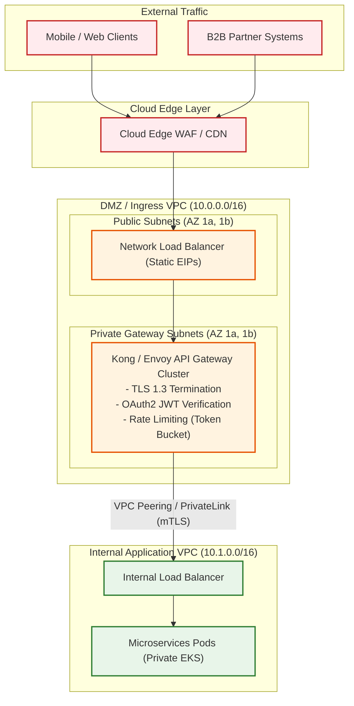

# API Gateway Network Architecture & Ingress Placement

Enterprise network topology detailing the network placement of API Gateways across public and private subnet boundaries, edge TLS offloading, and backend service routing.

## Mermaid Architecture Diagram



## PlantUML Specification

```plantuml
@startuml
actor Client
participant "Edge WAF" as waf
node "Public Subnet" {
  component "NLB (Static EIP)" as nlb
}
node "Private Gateway Subnet" {
  component "API Gateway (Envoy/Kong)" as gw
}
node "Private App Subnet" {
  component "Application Microservices" as app
}

Client -> waf : HTTPS Call
waf -> nlb : Forward
nlb -> gw : Layer 4 Forward
gw -> gw : Offload TLS & Validate JWT
gw -> app : Forward via PrivateLink (mTLS)
@enduml
```

## Architectural Design Considerations
* **Dual-Tier Load Balancing**: Use an external NLB for high-throughput Layer 4 TCP termination with static IP addresses, routing traffic directly to private API Gateway instances.
* **Separation of Gateway & App VPCs**: Isolating the API Gateway inside an Ingress/DMZ VPC prevents compromised gateway pods from having direct, uninspected Layer 2 access to internal databases.
* **PrivateLink Connectivity**: Connect Gateway VPCs to Application VPCs using AWS PrivateLink or Azure Private Link to avoid complex inter-VPC routing tables and CIDR overlap.

## Related Documentation & Patterns
* [Zero Trust Network](file:///d:/company/products/enterprise-architecture-handbook/17-diagrams/network/zero-trust-network.md)
* [Ingress & Egress](file:///d:/company/products/enterprise-architecture-handbook/17-diagrams/network/ingress-egress.md)
* [Security: API Security](file:///d:/company/products/enterprise-architecture-handbook/17-diagrams/security/api-security.md)
