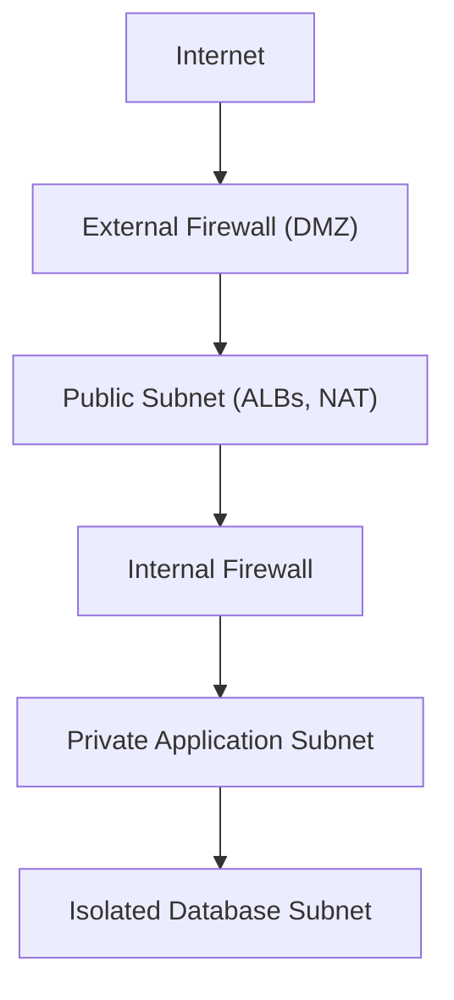

# Basic Enterprise Network Perimeter

```mermaid
flowchart TD
    Internet["Internet"] --> EdgeFirewall["External Firewall (DMZ)"]
    EdgeFirewall --> PublicSubnet["Public Subnet (ALBs, NAT)"]
    PublicSubnet --> CoreFirewall["Internal Firewall"]
    CoreFirewall --> PrivateSubnet["Private Application Subnet"]
    PrivateSubnet --> DBSubnet["Isolated Database Subnet"]
```
