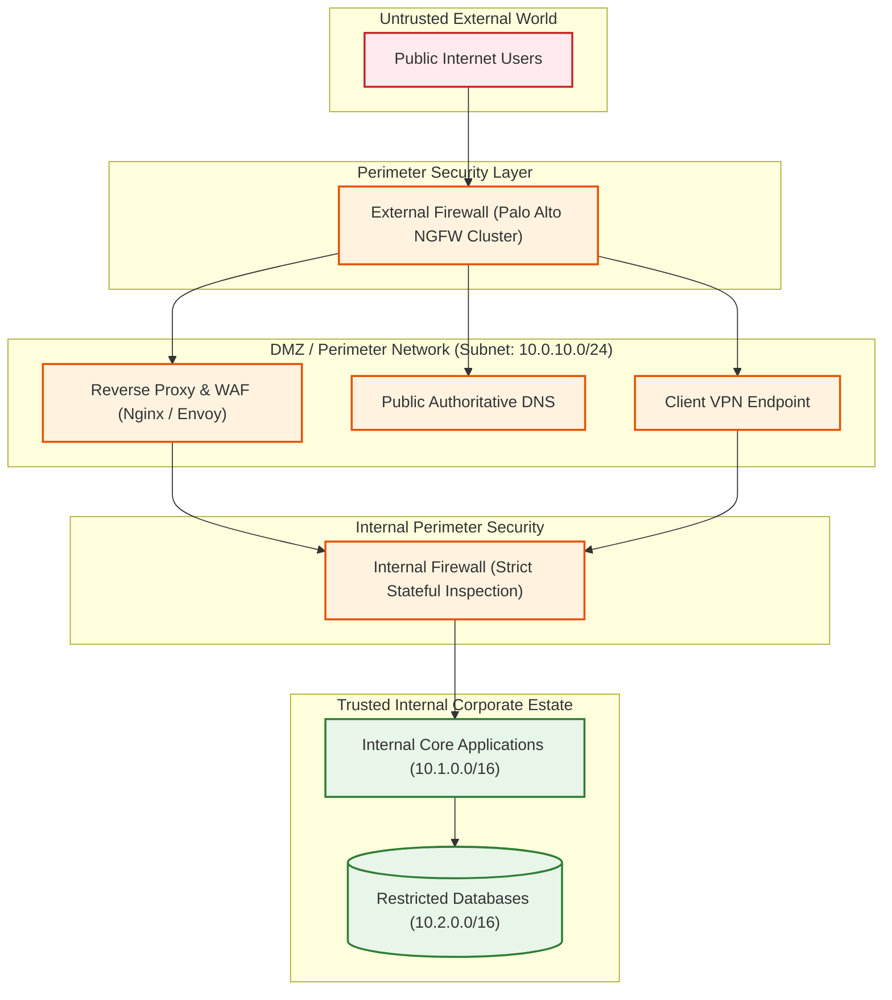
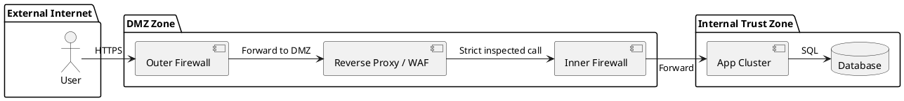

# Enterprise Demilitarized Zone (DMZ) Perimeter Architecture

Network perimeter architecture establishing a hardened Demilitarized Zone (DMZ) isolating external untrusted networks from internal corporate assets.

## Mermaid Architecture Diagram

## PlantUML Specification

## Architectural Design Considerations
* **Dual-Firewall Architecture**: Employ two distinct firewall layers (ideally from different vendors) to prevent a single configuration defect or CVE from breaching the internal network.
* **No Direct Inbound to Internal**: External internet traffic is strictly terminated in the DMZ; zero direct inbound routing to internal application subnets is permitted.
* **Session Break**: All proxy appliances in the DMZ must terminate client TCP connections and initiate brand-new outbound connections toward internal applications.

## Related Documentation & Patterns
* [API Gateway Network](file:///d:/company/products/enterprise-architecture-handbook/17-diagrams/network/api-gateway-network.md)
* [Ingress & Egress](file:///d:/company/products/enterprise-architecture-handbook/17-diagrams/network/ingress-egress.md)
* [Security: Trust Boundaries](file:///d:/company/products/enterprise-architecture-handbook/17-diagrams/security/trust-boundaries.md)
