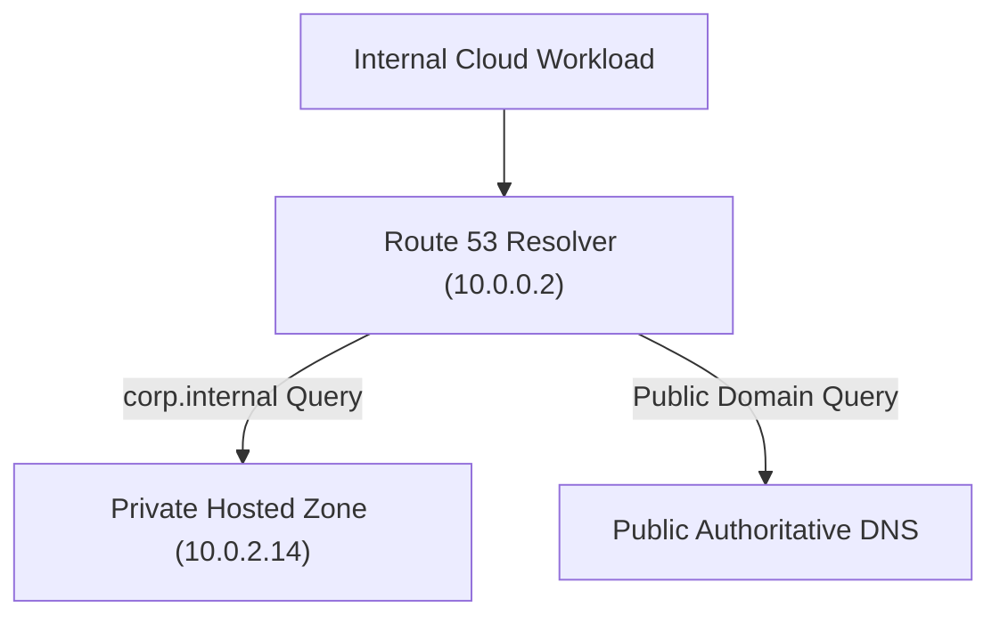

# Split-Horizon DNS Resolution Flow

```mermaid
flowchart TD
    Client["Internal Cloud Workload"] --> DNS["Route 53 Resolver (10.0.0.2)"]
    DNS -->|corp.internal Query| PrivateZone["Private Hosted Zone (10.0.2.14)"]
    DNS -->|Public Domain Query| InternetDNS["Public Authoritative DNS"]
```
