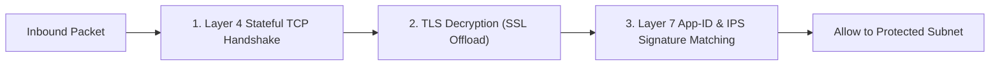

# Next-Generation Firewall (NGFW) Layer 7 Inspection

```mermaid
flowchart LR
    Packet["Inbound Packet"] --> TCPCheck["1. Layer 4 Stateful TCP Handshake"]
    TCPCheck --> TLS_Decrypt["2. TLS Decryption (SSL Offload)"]
    TLS_Decrypt --> L7_Inspect["3. Layer 7 App-ID & IPS Signature Matching"]
    L7_Inspect --> Allowed["Allow to Protected Subnet"]
```
