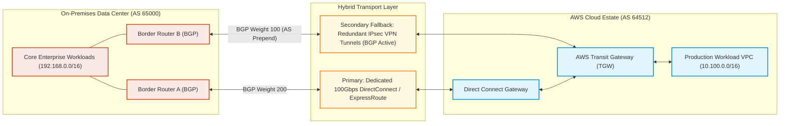
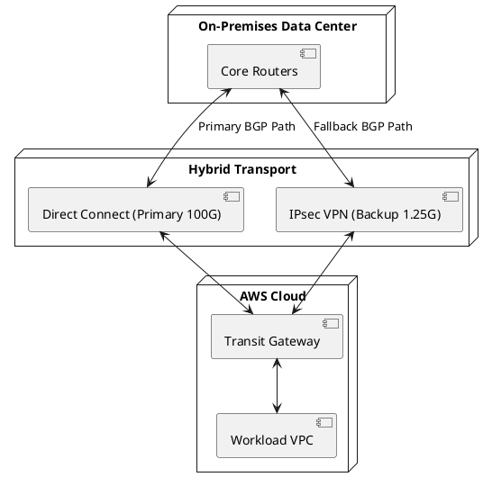

# Enterprise Hybrid Cloud Connectivity Architecture (DirectConnect & IPsec)

Resilient hybrid connectivity topology linking corporate private data centers with public cloud infrastructure using redundant dedicated circuits and automated IPsec VPN failover.

## Mermaid Architecture Diagram

## PlantUML Specification

## Architectural Design Considerations
* **Dynamic BGP Failover**: Enforce BGP dynamic routing with BFD (Bidirectional Forwarding Detection) to detect link degradation and trigger sub-second route failover.
* **AS Path Prepending**: Prepend autonomous system numbers on the backup IPsec VPN connection to ensure return traffic exclusively uses the high-bandwidth DirectConnect path during normal operation.
* **MTU Size Management**: Account for IPsec encapsulation overhead by clamping TCP MSS or configuring Jumbo Frames (9001 MTU) on DirectConnect circuits.

## Related Documentation & Patterns
* [Transit Network](file:///d:/company/products/enterprise-architecture-handbook/17-diagrams/network/transit-network.md)
* [Hub and Spoke](file:///d:/company/products/enterprise-architecture-handbook/17-diagrams/network/hub-spoke.md)
* [Cloud: Multi-Cloud](file:///d:/company/products/enterprise-architecture-handbook/17-diagrams/cloud/multi-cloud.md)
