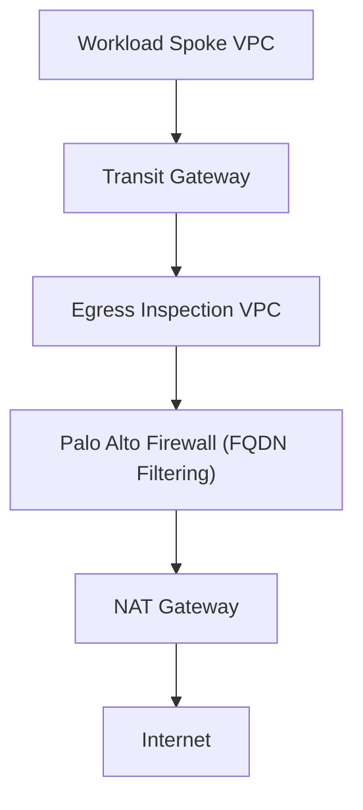

# Centralized Inspection VPC for Egress Filtering

```mermaid
flowchart TD
    SpokeVPC["Workload Spoke VPC"] --> TGW["Transit Gateway"]
    TGW --> InspectionVPC["Egress Inspection VPC"]
    InspectionVPC --> Firewall["Palo Alto Firewall (FQDN Filtering)"]
    Firewall --> NAT["NAT Gateway"] --> Internet["Internet"]
```
