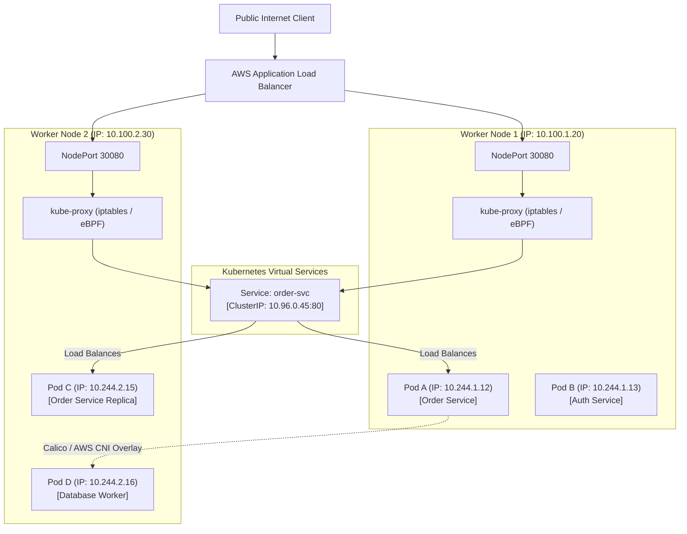

# Kubernetes CNI & Cluster Network Topology

Illustrates Pod CIDR allocation, overlay networking, Service ClusterIP discovery, and Ingress routing.

```mermaid
flowchart TD
    Internet["Public Internet Client"] --> ALB["AWS Application Load Balancer"]

    subgraph WorkerNode1["Worker Node 1 (IP: 10.100.1.20)"]
        NodePort1["NodePort 30080"]
        KubeProxy1["kube-proxy (iptables / eBPF)"]
        PodA["Pod A (IP: 10.244.1.12)
[Order Service]"]
        PodB["Pod B (IP: 10.244.1.13)
[Auth Service]"]
    end

    subgraph WorkerNode2["Worker Node 2 (IP: 10.100.2.30)"]
        NodePort2["NodePort 30080"]
        KubeProxy2["kube-proxy (iptables / eBPF)"]
        PodC["Pod C (IP: 10.244.2.15)
[Order Service Replica]"]
        PodD["Pod D (IP: 10.244.2.16)
[Database Worker]"]
    end

    subgraph ClusterServices["Kubernetes Virtual Services"]
        ServiceOrder["Service: order-svc
[ClusterIP: 10.96.0.45:80]"]
    end

    ALB --> NodePort1
    ALB --> NodePort2
    NodePort1 --> KubeProxy1
    NodePort2 --> KubeProxy2
    KubeProxy1 --> ServiceOrder
    KubeProxy2 --> ServiceOrder

    ServiceOrder -->|Load Balances| PodA
    ServiceOrder -->|Load Balances| PodC

    PodA -.->|Calico / AWS CNI Overlay| PodD
```
