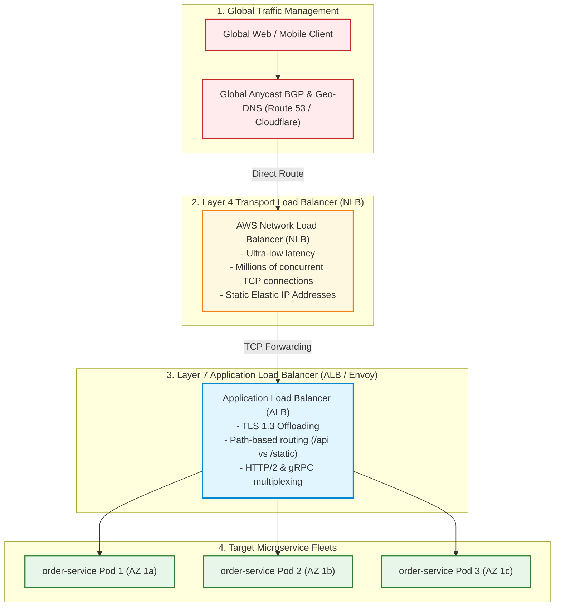

# Multi-Tier Load Balancing Architecture (Global DNS, L4, L7)

Comprehensive load balancing topology detailing traffic distribution across Global DNS (Anycast), Layer 4 Transport Load Balancers, and Layer 7 Application Proxies.

## Mermaid Architecture Diagram



## PlantUML Specification

```plantuml
@startuml
actor Client
participant "Route 53 (Geo DNS)" as dns
component "Layer 4 NLB (TCP)" as nlb
component "Layer 7 ALB (HTTP/2)" as alb
component "App Service Pods" as pods

Client -> dns : Resolve hostname
dns -> Client : Return optimal Regional IP
Client -> nlb : High-speed TCP stream
nlb -> alb : Balance across availability zones
alb -> pods : Route by path (/api/v1/orders)
@enduml
```

## Architectural Design Considerations
* **Layer 4 vs Layer 7 Trade-off**: L4 (NLB) offers extreme throughput and static IPs without inspecting payload; L7 (ALB) enables intelligent path routing, cookie stickiness, and header inspection.
* **Cross-Zone Load Balancing**: Enable cross-zone balancing on load balancers to distribute traffic uniformly across backend pods regardless of target availability zone sizing.
* **Deregistration Delay**: Configure connection draining (deregistration delay: 30-60s) to allow inflight HTTP transactions to complete cleanly before terminating pods.

## Related Documentation & Patterns
* [API Gateway Network](file:///d:/company/products/enterprise-architecture-handbook/17-diagrams/network/api-gateway-network.md)
* [Three-Tier Network](file:///d:/company/products/enterprise-architecture-handbook/17-diagrams/network/three-tier-network.md)
* [Multi-Region Network](file:///d:/company/products/enterprise-architecture-handbook/17-diagrams/network/multi-region-network.md)
