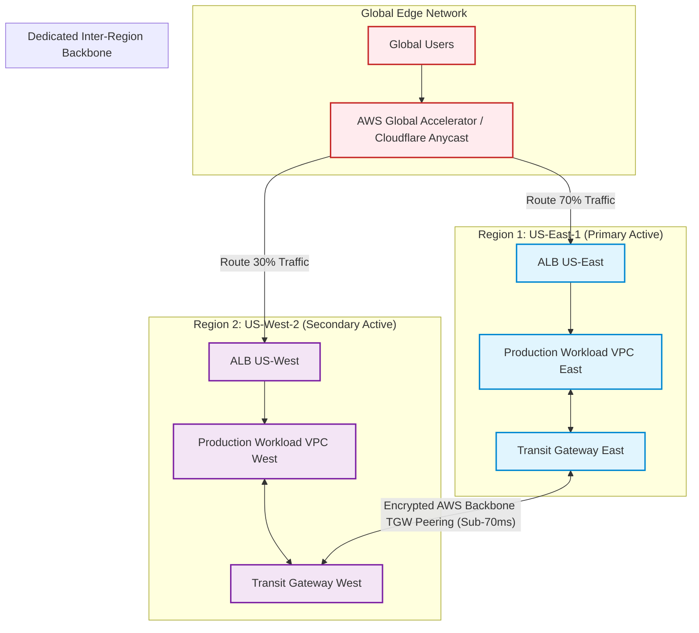
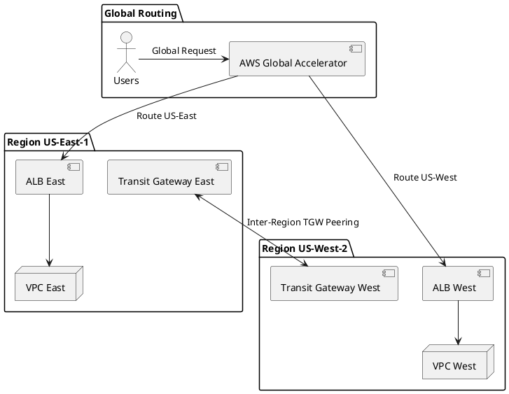

# Multi-Region Cloud Network Architecture & Interconnects

High-resilience multi-region network topology featuring global transit routing, low-latency inter-region peering, and automated disaster recovery traffic shifting.

## Mermaid Architecture Diagram

## PlantUML Specification

## Architectural Design Considerations
* **Private Cloud Backbone**: Leverage provider private backbones (AWS Inter-Region TGW Peering / Azure Global VNet Peering) rather than routing cross-region replication over the public internet.
* **Split-Brain Prevention**: Deploy a third neutral arbitration region or consensus witness (e.g., in US-Central or Cloudflare) to safely adjudicate automated regional failover.
* **Data Sovereignty Compliance**: Ensure inter-region routing rules explicitly respect international data residency requirements (e.g., GDPR data never leaves EU regions).

## Related Documentation & Patterns
* [Transit Network](file:///d:/company/products/enterprise-architecture-handbook/17-diagrams/network/transit-network.md)
* [Hub and Spoke](file:///d:/company/products/enterprise-architecture-handbook/17-diagrams/network/hub-spoke.md)
* [Deployment: Multi-Region](file:///d:/company/products/enterprise-architecture-handbook/17-diagrams/deployment/multi-region.md)
