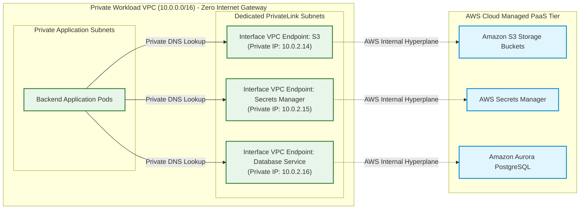
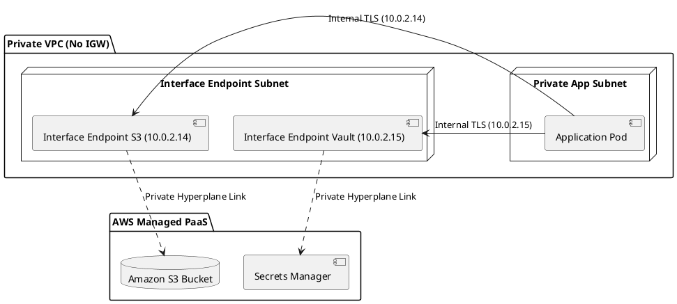

# Private Endpoints & Zero-Exgress PaaS Network Architecture

Zero-exgress network architecture detailing AWS PrivateLink and Azure Private Endpoints to access cloud PaaS services entirely within private VPC networks without traversing the public internet.

## Mermaid Architecture Diagram

## PlantUML Specification

## Architectural Design Considerations
* **Zero Internet Route**: Private endpoints allow removing NAT Gateways and Internet Gateways entirely from private database and application subnets, slashing data egress costs.
* **Endpoint Policies**: Attach strict IAM resource policies directly to VPC Endpoints to restrict access exclusively to designated corporate AWS accounts or S3 buckets.
* **Private DNS Integration**: Enable Private DNS resolution so existing application connection strings (e.g., `s3.amazonaws.com`) automatically resolve to private subnet IP addresses without code changes.

## Related Documentation & Patterns
* [Zero Trust Network](file:///d:/company/products/enterprise-architecture-handbook/17-diagrams/network/zero-trust-network.md)
* [Public & Private Subnets](file:///d:/company/products/enterprise-architecture-handbook/17-diagrams/network/public-private-subnet.md)
* [Security: Secrets Management](file:///d:/company/products/enterprise-architecture-handbook/17-diagrams/security/secrets-management.md)
