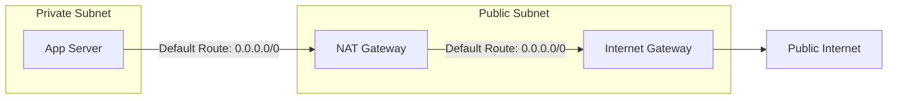

# Public vs Private Subnet Routing Table Architecture

```mermaid
flowchart LR
    subgraph PublicSubnet["Public Subnet"]
        NAT["NAT Gateway"]
        IGW["Internet Gateway"]
    end
    subgraph PrivateSubnet["Private Subnet"]
        App["App Server"]
    end
    App -->|Default Route: 0.0.0.0/0| NAT
    NAT -->|Default Route: 0.0.0.0/0| IGW
    IGW --> Internet["Public Internet"]
```
