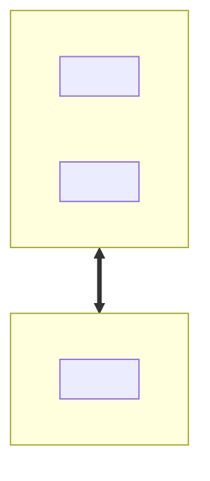

# Network Diagram Starter Template

```mermaid
flowchart TD
    subgraph Transit["<Hub / Transit Network>"]
        TGW["<Transit Hub / Router>"]
        FW["<Firewall Cluster>"]
    end
    subgraph Spoke["<Workload Network>"]
        Workload["<Private Compute>"]
    end
    Transit <==> Spoke
```
