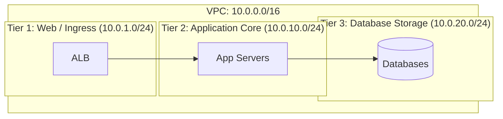

# Three-Tier Subnet Network Architecture

```mermaid
flowchart TD
    subgraph VPC["VPC: 10.0.0.0/16"]
        subgraph Tier1["Tier 1: Web / Ingress (10.0.1.0/24)"]
            ALB["ALB"]
        end
        subgraph Tier2["Tier 2: Application Core (10.0.10.0/24)"]
            Apps["App Servers"]
        end
        subgraph Tier3["Tier 3: Database Storage (10.0.20.0/24)"]
            DB[("Databases")]
        end
    end
    ALB --> Apps --> DB
```
