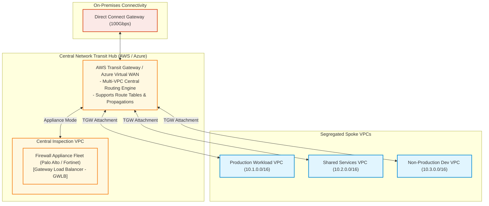
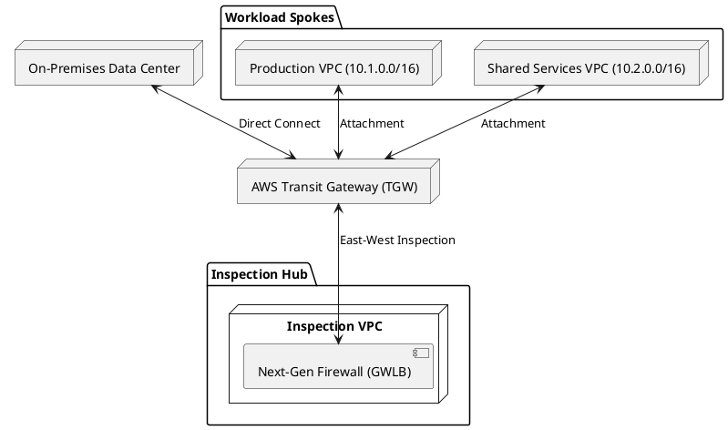

# Enterprise Transit Network & Hub-and-Spoke Routing Architecture

Enterprise transit network topology utilizing cloud Transit Gateways to interconnect hundreds of workload VPCs, on-premises networks, and centralized security inspection appliances.

## Mermaid Architecture Diagram

## PlantUML Specification

## Architectural Design Considerations
* **Appliance Mode**: Enable `ApplianceModeSupport` on the Transit Gateway attachment for the inspection VPC to ensure symmetrical return traffic through the same stateful firewall instance.
* **Route Table Segregation**: Create separate TGW route tables for Production and Non-Production to isolate environments at the network layer without permitting cross-environment routing.
* **Scalability**: A single Transit Gateway supports up to 5,000 VPC attachments and up to 50 Gbps of burst bandwidth per attachment.

## Related Documentation & Patterns
* [Hub and Spoke](file:///d:/company/products/enterprise-architecture-handbook/17-diagrams/network/hub-spoke.md)
* [Hybrid Connectivity](file:///d:/company/products/enterprise-architecture-handbook/17-diagrams/network/hybrid-connectivity.md)
* [Multi-Region Network](file:///d:/company/products/enterprise-architecture-handbook/17-diagrams/network/multi-region-network.md)
