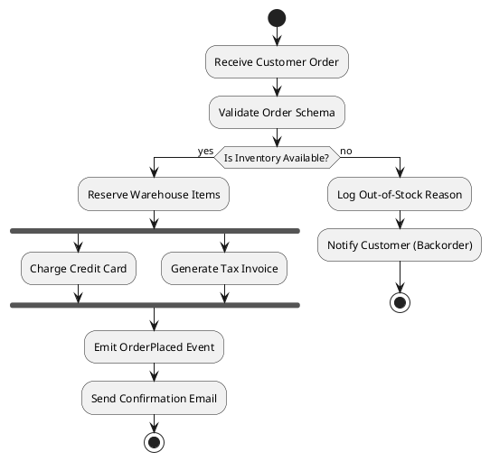

# PlantUML Activity Diagrams (Workflow & Decision Logic)

Activity diagrams model algorithmic execution flows, approval workflows, and parallel asynchronous tasks.

```plantuml
@startuml
skinparam shadowing false

start
:Receive Customer Order;
:Validate Order Schema;

if (Is Inventory Available?) then (yes)
  :Reserve Warehouse Items;
  fork
    :Charge Credit Card;
  fork again
    :Generate Tax Invoice;
  end fork
  :Emit OrderPlaced Event;
  :Send Confirmation Email;
  stop
else (no)
  :Log Out-of-Stock Reason;
  :Notify Customer (Backorder);
  stop
endif
@enduml
```
