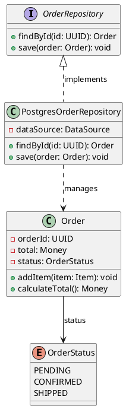

# PlantUML Class Diagrams & Structural Modeling

Class diagrams capture domain aggregates, object inheritance, interfaces, and member visibility.

```plantuml
@startuml
skinparam shadowing false

interface OrderRepository {
  +findById(id: UUID): Order
  +save(order: Order): void
}

class Order {
  -orderId: UUID
  -total: Money
  -status: OrderStatus
  +addItem(item: Item): void
  +calculateTotal(): Money
}

enum OrderStatus {
  PENDING
  CONFIRMED
  SHIPPED
}

class PostgresOrderRepository {
  -dataSource: DataSource
  +findById(id: UUID): Order
  +save(order: Order): void
}

OrderRepository <|.. PostgresOrderRepository : implements
Order --> OrderStatus : status
PostgresOrderRepository ..> Order : manages
@enduml
```
