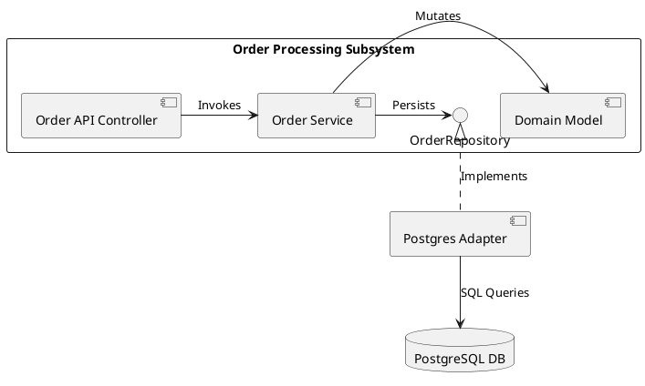

# PlantUML Component Diagrams & Interfaces

Component diagrams model software packages, subsystems, provided and required interfaces.

```plantuml
@startuml
skinparam shadowing false
skinparam packageStyle rectangle

package "Order Processing Subsystem" {
  component "Order API Controller" as ctrl
  component "Order Service" as svc
  component "Domain Model" as domain
  interface "OrderRepository" as repoPort
  
  ctrl -> svc : Invokes
  svc -> domain : Mutates
  svc -> repoPort : Persists
}

database "PostgreSQL DB" as db
component "Postgres Adapter" as adapter

repoPort <|.. adapter : Implements
adapter --> db : SQL Queries
@enduml
```
