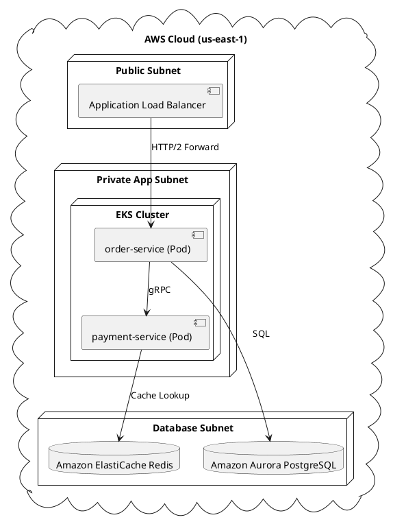

# PlantUML Deployment Diagrams & Cloud Infrastructure

Deployment diagrams capture execution environments, virtual machines, cloud services, and network boundaries.

```plantuml
@startuml
skinparam shadowing false

cloud "AWS Cloud (us-east-1)" {
  node "Public Subnet" {
    component "Application Load Balancer" as alb
  }
  
  node "Private App Subnet" {
    node "EKS Cluster" {
      component "order-service (Pod)" as pod1
      component "payment-service (Pod)" as pod2
    }
  }
  
  node "Database Subnet" {
    database "Amazon Aurora PostgreSQL" as aurora
    database "Amazon ElastiCache Redis" as redis
  }
}

alb --> pod1 : HTTP/2 Forward
pod1 --> pod2 : gRPC
pod1 --> aurora : SQL
pod2 --> redis : Cache Lookup
@enduml
```
