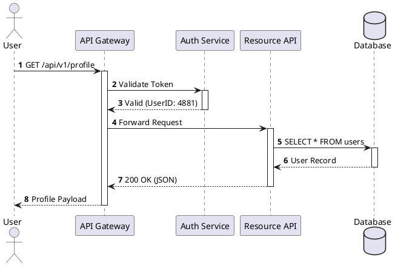

# PlantUML Sequence Diagrams & Lifeline Management

PlantUML sequence diagrams provide rich control over activation boxes, lifelines, and nested conditions.

```plantuml
@startuml
autonumber
skinparam shadowing false

actor "User" as user
participant "API Gateway" as gw
participant "Auth Service" as auth
participant "Resource API" as api
database "Database" as db

user -> gw : GET /api/v1/profile
activate gw
gw -> auth : Validate Token
activate auth
auth --> gw : Valid (UserID: 4881)
deactivate auth

gw -> api : Forward Request
activate api
api -> db : SELECT * FROM users
activate db
db --> api : User Record
deactivate db
api --> gw : 200 OK (JSON)
deactivate api
gw --> user : Profile Payload
deactivate gw
@enduml
```
