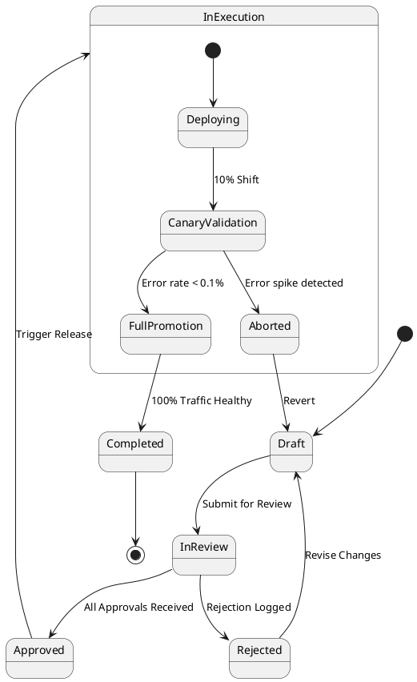

# PlantUML State Machine Diagrams

State machine diagrams illustrate finite state transitions, composite substates, and guard conditions.

```plantuml
@startuml
skinparam shadowing false

[*] --> Draft

Draft --> InReview : Submit for Review
InReview --> Approved : All Approvals Received
InReview --> Rejected : Rejection Logged
Rejected --> Draft : Revise Changes

state InExecution {
  [*] --> Deploying
  Deploying --> CanaryValidation : 10% Shift
  CanaryValidation --> FullPromotion : Error rate < 0.1%
  CanaryValidation --> Aborted : Error spike detected
}

Approved --> InExecution : Trigger Release
FullPromotion --> Completed : 100% Traffic Healthy
Aborted --> Draft : Revert
Completed --> [*]
@enduml
```
