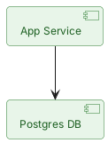

# PlantUML Theming, Skinparams & Styling Guide

## Enterprise Neutral Skinparams

```plantuml
@startuml
skinparam defaultFontName "Inter", Arial, sans-serif
skinparam defaultFontSize 12
skinparam shadowing false
skinparam roundcorner 8

skinparam package {
  BackgroundColor #FAFAFA
  BorderColor #BDBDBD
}

skinparam component {
  BackgroundColor #E8F5E9
  BorderColor #2E7D32
  FontColor #1B5E20
}

skinparam database {
  BackgroundColor #E1F5FE
  BorderColor #0288D1
  FontColor #01579B
}

[App Service] --> [Postgres DB]
@enduml
```
