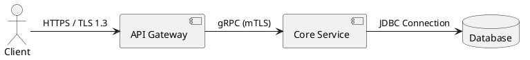

# PlantUML Architecture Starter Template

```plantuml
@startuml
skinparam shadowing false
skinparam packageStyle rectangle

actor "Client" as client
component "API Gateway" as gw
component "Core Service" as svc
database "Database" as db

client -> gw : HTTPS / TLS 1.3
gw -> svc : gRPC (mTLS)
svc -> db : JDBC Connection
@enduml
```
