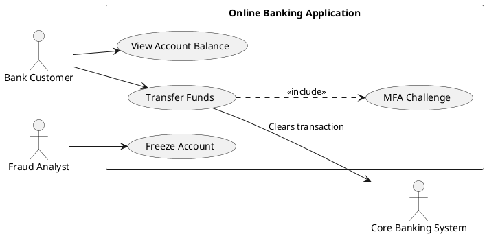

# PlantUML Use Case Diagrams

Use case diagrams establish functional boundaries, primary actors, and system capabilities.

```plantuml
@startuml
skinparam shadowing false
left to right direction

actor "Bank Customer" as cust
actor "Fraud Analyst" as fraud
actor "Core Banking System" as core

rectangle "Online Banking Application" {
  usecase "View Account Balance" as UC1
  usecase "Transfer Funds" as UC2
  usecase "MFA Challenge" as UC3
  usecase "Freeze Account" as UC4
}

cust --> UC1
cust --> UC2
UC2 ..> UC3 : <<include>>
fraud --> UC4
UC2 --> core : Clears transaction
@enduml
```
