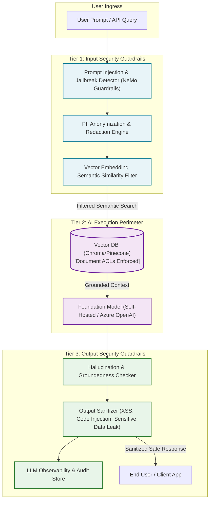
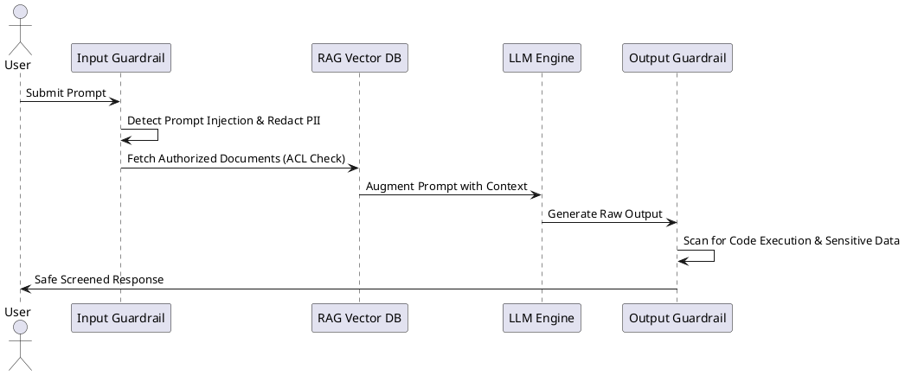

# AI & Large Language Model (LLM) Security Architecture

Security defense pipeline for generative AI workloads mitigating prompt injection, data leakage, model theft, and insecure output handling (OWASP LLM Top 10).

## Mermaid Architecture Diagram

## PlantUML Specification

## Architectural Design Considerations

* **OWASP Top 10 for LLM**: Prioritize mitigations for Prompt Injection (LLM01), Insecure Output Handling (LLM02), and Sensitive Information Disclosure (LLM06).
* **Document-Level ACLs in RAG**: Enforce user identity and enterprise authorization checks during vector similarity searches to prevent privilege escalation through AI context.
* **Model Sandboxing**: Execute all LLM-generated code or tool calls inside isolated, network-restricted execution environments (e.g., gVisor, Firecracker).

## Related Documentation & Patterns

* [Threat Model](file:///d:/company/products/enterprise-architecture-handbook/17-diagrams/security/threat-model.md)
* [Data Classification](file:///d:/company/products/enterprise-architecture-handbook/17-diagrams/security/data-classification.md)
* [Trust Boundaries](file:///d:/company/products/enterprise-architecture-handbook/17-diagrams/security/trust-boundaries.md)
