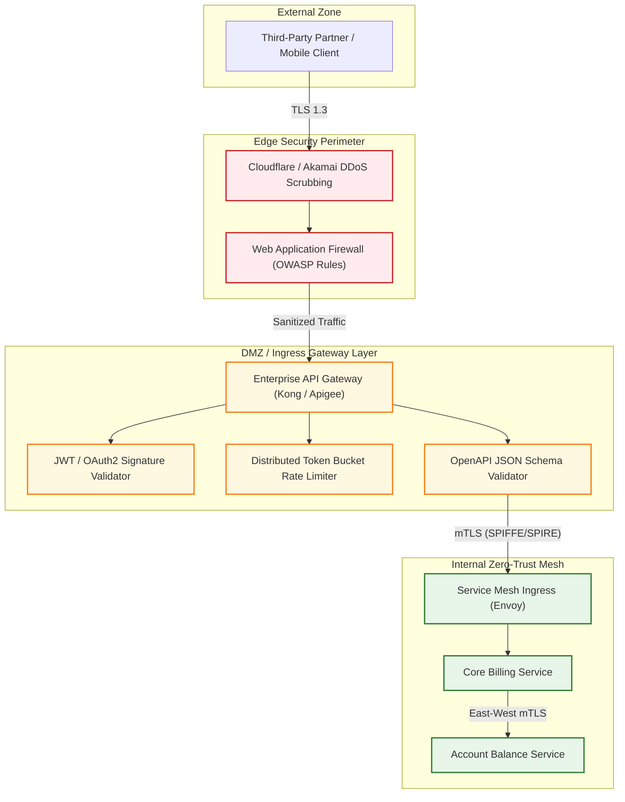
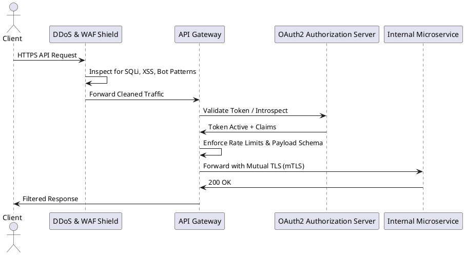

# Enterprise API Security Architecture & Defense-in-Depth

Multi-layered API threat mitigation architecture covering L7 API gateway enforcement, schema validation, rate throttling, and mTLS.

## Mermaid Architecture Diagram

## PlantUML Specification

## Architectural Design Considerations

* **OWASP API Security Top 10**: Mitigate Broken Object Level Authorization (BOLA) and Broken Authentication directly at the gateway and domain layers.
* **Strict Schema Enforcement**: Block malformed JSON bodies and unexpected parameters before requests reach backend application code.
* **Mutual TLS (mTLS)**: Enforce mTLS for all B2B partner integrations and internal microservice-to-microservice communication.

## Related Documentation & Patterns

* [OAuth 2.0](file:///d:/company/products/enterprise-architecture-handbook/17-diagrams/security/oauth2.md)
* [WAF & DDoS](file:///d:/company/products/enterprise-architecture-handbook/17-diagrams/security/waf.md)
* [Zero Trust](file:///d:/company/products/enterprise-architecture-handbook/17-diagrams/security/zero-trust.md)
