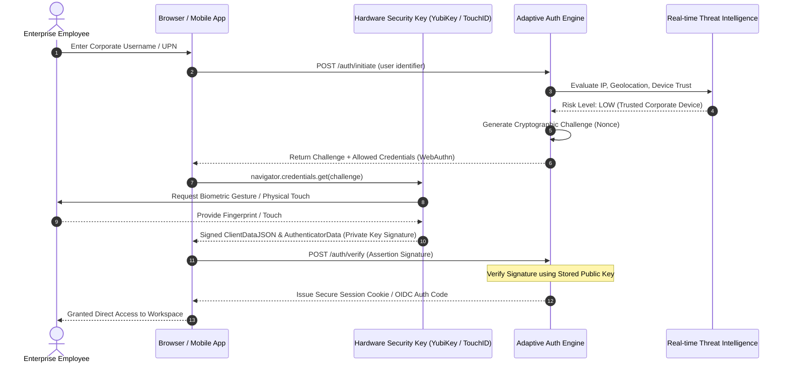
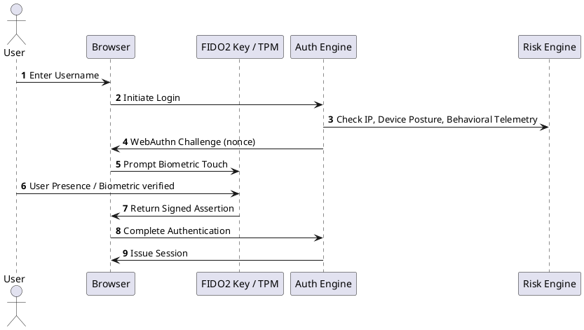

# Enterprise Multi-Factor Authentication (MFA) & Passwordless Flow

FIDO2 / WebAuthn passwordless authentication architecture combined with adaptive risk analysis and continuous biometric challenges.

## Mermaid Architecture Diagram

## PlantUML Specification

## Architectural Design Considerations

* **Phishing Resistance**: Prioritize FIDO2 / WebAuthn passkeys over SMS, voice, or push notifications (which are vulnerable to MFA fatigue and adversary-in-the-middle).
* **Step-Up Authentication**: Trigger higher-level verification dynamically when attempting high-privilege operations (e.g., wire transfers, firewall rule modifications).
* **Fallback Hardening**: Ensure account recovery processes require rigorous out-of-band verification to prevent social engineering helpdesk attacks.

## Related Documentation & Patterns

* [Zero Trust](file:///d:/company/products/enterprise-architecture-handbook/17-diagrams/security/zero-trust.md)
* [Identity Flow](file:///d:/company/products/enterprise-architecture-handbook/17-diagrams/security/identity-flow.md)
* [Privileged Access](file:///d:/company/products/enterprise-architecture-handbook/17-diagrams/security/privileged-access.md)
