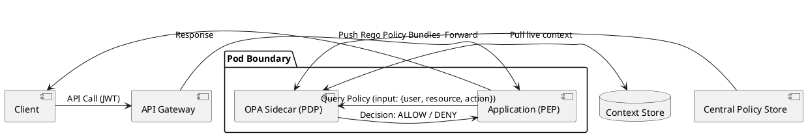

# Enterprise Authorization: ABAC & Open Policy Agent (OPA)

Fine-grained policy-as-code architecture utilizing Attribute-Based Access Control (ABAC) and Open Policy Agent (OPA) sidecar policy enforcement.

## Mermaid Architecture Diagram

```mermaid
graph TB
    subgraph ClientEnv ["Client & Ingress Layer"]
        ClientApp["Single Page App / API Consumer"]
        GW["API Gateway / Envoy Ingress"]
        ClientApp -->|"Request with JWT"| GW
    end

    subgraph ServiceMesh ["Service Pod / Container"]
        Microservice["Payment Execution Service (PEP)"]
        OPASidecar["OPA Agent (PDP Sidecar)<br/>[Evaluates Rego Policies]"]
        
        GW -->|"Forward Traffic"| Microservice
        Microservice -->|"Local REST/gRPC Query<br/>(Subject, Action, Resource)"| OPASidecar
    end

    subgraph PolicyDistribution ["Central Governance & Policy Control"]
        GitRepo["Policy Git Repo<br/>[Rego Rules / Versioned]"]
        Styra["Central Policy Control Plane<br/>[Styra DAS / Spire]"]
        DataSync["Context Data Store<br/>[User Attributes / Tenant Roles]"]
        
        GitRepo -->|"CI/CD Webhook"| Styra
        Styra -->|"Bundle Distribution (Polling/Websocket)"| OPASidecar
        DataSync -->|"Dynamic Attributes Push"| OPASidecar
    end

    OPASidecar -->>|"Allow: true / false"| Microservice
    Microservice -->|"Authorized Operation"| TargetDB[(PostgreSQL Ledger)]

    classDef mesh fill:#e1f5fe,stroke:#0288d1,stroke-width:2px;
    classDef policy fill:#f3e5f5,stroke:#7b1fa2,stroke-width:2px;
    class Microservice,OPASidecar mesh;
    class GitRepo,Styra,DataSync policy;
```

## PlantUML Specification



## Architectural Design Considerations

* **Decoupled Architecture**: Separate policy decisions (PDP) from policy enforcement (PEP) so business logic remains cleanly separated from compliance rules.
* **Low Latency Evaluation**: Run OPA as a local localhost sidecar or embedded WebAssembly module to ensure sub-millisecond policy evaluation.
* **Policy As Code**: All access rules must be stored in Git, unit tested with test fixtures, and deployed via automated CI/CD pipelines.

## Related Documentation & Patterns

* [Zero Trust](file:///d:/company/products/enterprise-architecture-handbook/17-diagrams/security/zero-trust.md)
* [IAM Architecture](file:///d:/company/products/enterprise-architecture-handbook/17-diagrams/security/iam.md)
* [API Security](file:///d:/company/products/enterprise-architecture-handbook/17-diagrams/security/api-security.md)
