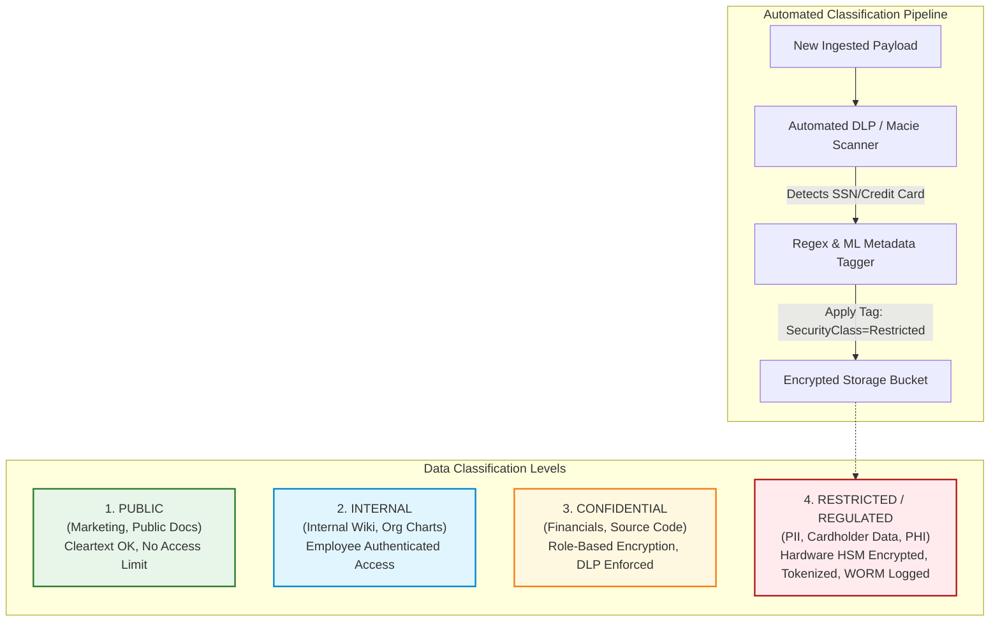
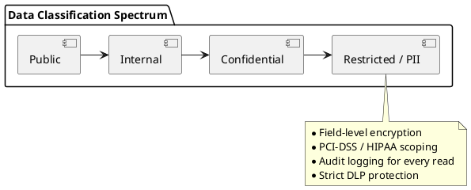

# Enterprise Data Classification & Handling Architecture

Data tier classification framework (Public, Internal, Confidential, Restricted) and automated compliance tagging pipelines.

## Mermaid Architecture Diagram

## PlantUML Specification

## Architectural Design Considerations

* **Automated Data Discovery**: Leverage automated classifiers (e.g., AWS Macie, Microsoft Purview) to continually scan S3 buckets and databases for unclassified PII.
* **Tokenization of Restricted Data**: Replace sensitive PANs or SSNs with non-reversible random tokens; store raw data only in an isolated PCI vault.
* **Retention and Deletion**: Enforce automated data lifecycle policies that permanently shred confidential and restricted data once mandatory retention periods expire.

## Related Documentation & Patterns

* [Encryption](file:///d:/company/products/enterprise-architecture-handbook/17-diagrams/security/encryption.md)
* [Trust Boundaries](file:///d:/company/products/enterprise-architecture-handbook/17-diagrams/security/trust-boundaries.md)
* [Secrets Management](file:///d:/company/products/enterprise-architecture-handbook/17-diagrams/security/secrets-management.md)
